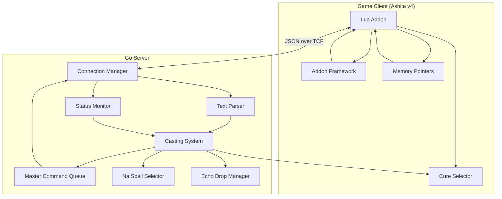

# Design Document: Automated Gameplay Assistant

## Overview

The Automated Gameplay Assistant is a distributed system consisting of a Lua addon for the Ashita v4 game client and a Go server that provides intelligent automation for spell casting, status monitoring, and text parsing. The system enables real-time analysis of party status, automated responses to chat triggers, and prioritized action execution based on game state.

The architecture follows a client-server model where the lightweight Lua addon handles game interface operations using Ashita v4's addon framework and memory pointers while the Go server performs complex decision-making, prioritization, and state management. Communication occurs over TCP using a JSON-based protocol for maximum compatibility and reliability.

## Architecture

### High-Level Architecture



### Communication Flow

1. **Status Updates**: Lua addon uses Ashita v4 memory pointers to read party status (including actual HP/MP values) and sends to Go server via JSON protocol
2. **Chat Monitoring**: Lua addon uses Ashita v4 text events to capture tells/party messages and forwards to Go server as JSON
3. **Decision Making**: Go server analyzes data and determines required actions using centralized Casting System
4. **Command Queuing**: Actions are placed in a server-side master queue prioritized by numerical values (1-100)
5. **Action Execution**: Go server sends the next available command to the Lua addon and waits for completion
6. **Game Execution**: Lua addon uses Ashita v4 command system to execute spells and actions immediately in the game client
7. **Completion Reporting**: Lua addon notifies Go server of spell completion or failure to trigger the next queued command

## Components and Interfaces

### Lua Addon Components (Ashita v4)

#### Connection Manager
- Establishes and maintains TCP connection to Go server using Lua sockets
- Handles automatic reconnection with exponential backoff
- Manages message queuing during disconnections
- Uses simple line-delimited text protocol for maximum compatibility

#### Ashita v4 Event Handler
- Registers for Ashita v4 text_in events to monitor tells and party messages
- Uses Ashita v4 d3d_present events for periodic status collection
- Implements Ashita v4 addon lifecycle events (load, unload)
- Handles Ashita v4 command events for addon control

#### Memory Interface
- Uses Ashita v4 memory pointer system to read party member data directly
- Accesses HP, MP, and status effect information from game memory structures
- Monitors player position, zone, and job information via memory scanning
- Tracks buff/debuff states using direct memory access

#### Command Executor
- Uses Ashita v4 ChatManager:QueueCommand to execute spells and actions
- Parses JSON commands from Go server
- Executes commands immediately without local buffering
- Reports completion or failure status back to Go server
- Provides error reporting through Ashita v4 print functions

### Go Server Components

#### Connection Manager
- Accepts and manages multiple client connections
- Handles JSON protocol parsing and length-prefixed framing
- Routes messages to appropriate processing components
- Manages client state and connection health

#### Text Parser
- Analyzes incoming chat messages for trigger words
- Maintains configurable trigger word dictionary
- Identifies trigger types and passes events to Casting System
- Filters messages based on sender authorization

#### Status Monitor
- Tracks real-time party member health and status
- Maintains historical data for trend analysis
- Identifies critical health thresholds
- Detects status effects requiring removal

#### Casting System
- Centralizes all spell selection and target resolution logic
- Coordinates with Cure, Na, and Buff selectors
- Manages sequence casting and self-targeting resolution
- Provides prioritized requests to a Master Command Queue

#### Master Command Queue (Server-Side)
- Maintains a per-client queue of prioritized actions (1-100)
- Enforces serial execution (one command at a time)
- Handles command timeouts and re-processing upon completion/failure
- Stores up to 100 commands per client

#### Cure Selector
- Calculates optimal cure spell level based on missing HP
- Considers MP efficiency and casting time
- Validates caster MP availability
- Selects between single-target and AoE healing options
- Automatically switches to curaga spells when three or more party members need healing simultaneously

#### Na Spell Selector
- Identifies specific status effects requiring removal
- Maps status effects to appropriate "na" spells
- Prioritizes life-threatening conditions
- Validates spell availability and MP requirements

#### Echo Drop Manager
- Monitors player silence status in real-time
- Manages echo drop inventory tracking
- Prioritizes echo drop usage above all other actions when player is silenced
- Interrupts current casting queues for immediate silence removal

## Data Models

### JSON Protocol

The system uses a JSON-based protocol over TCP with a 4-byte big-endian length prefix for framing.

**Message Format**: `[4-byte Length][JSON Body]`

**Common Message Types**:
- `1 (TypePing)` - Heartbeat check
- `2 (TypePong)` - Heartbeat response  
- `10 (TypeExecuteCommand)` - Server to client command execution
- `20 (TypeChatLine)` - Client to server chat forwarding
- `21 (TypeStatusUpdate)` - Client to server status update
- `31 (TypeSpellComplete)` - Client to server success notification
- `32 (TypeSpellFailed)` - Client to server failure notification

### Action Commands

```go
type ExecuteCommand struct {
    Command  string `json:"command"`  // "/ma \"Cure IV\" <t>"
    Target   string `json:"target"`   // Player name or <t>, <me>
    Priority int    `json:"priority"` // Execution priority (1-100)
    Timeout  int    `json:"timeout"`  // Max execution time (ms)
    ID       string `json:"id"`       // Unique command ID
}
```

### Status Updates

```go
type StatusUpdate struct {
    Timestamp    int64          `json:"timestamp"`
    PartyMembers []PartyMember  `json:"party_members"`
    PlayerMP     int            `json:"player_mp"`
    PlayerHP     int            `json:"player_hp"`
    PlayerStatus []int          `json:"player_status"` // Player's own status effects
    EchoDropCount int           `json:"echo_drop_count"`
    Zone         string         `json:"zone"`
}

type PartyMember struct {
    Name         string   `json:"name"`
    HPPercent    int      `json:"hp_percent"`
    MPPercent    int      `json:"mp_percent"`
    HPActual     int      `json:"hp_actual"`
    HPMax        int      `json:"hp_max"`
    StatusEffects []int   `json:"status_effects"`
    Job          string   `json:"job"`
    Distance     float32  `json:"distance"`
}
```

### Chat Messages

```go
type ChatLine struct {
    Mode      uint32 `json:"mode"`      // Chat channel type
    Sender    string `json:"sender"`    // Player name
    Message   string `json:"message"`   // Chat content
    Timestamp int64  `json:"timestamp"` // Message timestamp
}
```

### Spell Definitions

```go
type Spell struct {
    Name        string            `msgpack:"name"`
    ID          uint16            `msgpack:"id"`
    MPCost      uint16            `msgpack:"mp"`
    CastTime    float32           `msgpack:"cast_time"`
    Recast      float32           `msgpack:"recast"`
    JobLevels   map[string]int    `msgpack:"job_levels"`
    SpellType   SpellType         `msgpack:"type"`
    Element     Element           `msgpack:"element"`
    Targets     TargetType        `msgpack:"targets"`
    HealAmount  int               `msgpack:"heal_amount"`
}
```

## Priority Management

The system uses a standardized priority hierarchy (1-100) to ensure critical actions are always performed first. Higher numerical values indicate higher priority.

| Priority Level | Numerical Value | Action Type | Examples |
| :--- | :--- | :--- | :--- |
| **Highest** | 100 | Self-Recovery | Echo Drop (Silence), Item Usage |
| **Higher** | 80 | Critical Healing | Cure spells when HP <= 20% |
| **High** | 60 | Vital Status Removal | Stona, Paralyna, Silena |
| **Normal** | 40 | Routine Healing | Non-critical cures (HP > 20%) |
| **Lowest** | 20 | Utility | Buffs, Shell, Protect, etc. |

### Priority Execution Rules
- **Serial Execution**: Only one command is sent to the client at a time. The server waits for a completion or failure report before sending the next highest priority command.
- **Preemption**: If a new action with higher priority is queued while another is in progress, the higher priority action becomes the next in line.
- **Queue Limit**: The Go server maintains a master queue of up to 100 commands per client, removing the oldest lowest priority actions if the limit is exceeded.
- **Queue Garbage Collection (GC)**: The server periodically (and upon status updates) evaluates queued actions against the current game state. If an action's reason for existing is no longer valid (e.g., target already healed by another player or a curaga), the action is removed from the queue to prevent redundant or wasteful casting.
- **Self-Recovery Preemption**: Detection of silence status on the player assigns a priority of 100 to Echo Drop usage, which may interrupt or delay any other queued casting operations.

*A property is a characteristic or behavior that should hold true across all valid executions of a system-essentially, a formal statement about what the system should do. Properties serve as the bridge between human-readable specifications and machine-verifiable correctness guarantees.*

### Property Reflection

After reviewing all properties identified in the prework, several can be consolidated to eliminate redundancy:

- Properties 5.2 and 5.3 (minor vs critical damage cure selection) can be combined into Property 5.1 (optimal cure level calculation)
- Properties 4.2, 4.3, 4.4, and 4.6 (various prioritization scenarios) can be combined into Property 4.1 (general prioritization ranking)
- Properties 1.1 and 1.2 (command execution and parsing) can be combined since parsing is part of execution
- Properties 3.3 and 3.4 (cure and na spell determination) are already covered by Properties 5.1 and 6.1 respectively

### Correctness Properties

Property 1: Command execution and parsing
*For any* valid Action_Command sent from the Go_Server, the Lua_Plugin should correctly parse the spell name and target, then execute the command in the game client
**Validates: Requirements 1.1, 1.2**

Property 2: Error handling for malformed commands
*For any* malformed or invalid Action_Command, the Lua_Plugin should log the error and continue normal operation without crashing
**Validates: Requirements 1.3**

Property 3: Command queue management
*For any* sequence of Action_Commands received by the Go_Server, they should be queued and sent in priority order (1-100), with higher priority commands (like critical heals) being sent before lower priority commands (like buffs)
**Validates: Requirements 1.4, 4.1**

Property 4: Error reporting
*For any* Action_Command that fails to execute, the Lua_Plugin should report the failure status back to the Go_Server
**Validates: Requirements 1.5**

Property 5: Message forwarding
*For any* chat message containing trigger words from authorized party members, the Lua_Plugin should forward the complete message to the Go_Server for processing
**Validates: Requirements 2.1**

Property 6: Multi-trigger prioritization
*For any* chat message containing multiple trigger words, the Casting System should determine an optimal casting sequence based on urgency and importance
**Validates: Requirements 2.4, 8.5**

Property 7: Unauthorized player filtering
*For any* trigger word detected from an unknown or unauthorized player, the Go_Server should ignore the request and log the event without taking action
**Validates: Requirements 2.5**

Property 8: Periodic status reporting
*For any* time interval while the game is running, the Lua_Plugin should send Status_Messages to the Go_Server at regular, predictable intervals
**Validates: Requirements 3.1**

Property 9: Status message completeness
*For any* Status_Message sent by the Lua_Plugin, it should include current HP, MP, and status effects for all Party_Members in the party
**Validates: Requirements 3.2**

Property 10: Connection monitoring and recovery
*For any* period where Status_Messages are not received within expected intervals, the Go_Server should log connection issues and attempt reconnection
**Validates: Requirements 3.5**

Property 11: Action prioritization ranking
*For any* set of multiple concurrent healing, buffing, or status removal needs, the Casting System should rank actions by urgency (1-100 scale) and importance
**Validates: Requirements 4.1, 4.2, 4.3, 4.4, 4.6**

Property 12: Resource optimization
*For any* scenario where spell casting resources (MP) are limited, the Spell_Prioritizer should optimize MP usage and casting efficiency while maintaining healing effectiveness
**Validates: Requirements 4.5**

Property 13: Optimal cure level calculation
*For any* Party_Member needing healing, the Go_Server should calculate the optimal cure spell level based on missing HP, considering both MP efficiency for minor damage and maximum healing for critical damage
**Validates: Requirements 5.1, 5.2, 5.3**

Property 14: Cure option optimization
*For any* healing scenario where multiple cure options are available, the Go_Server should consider both casting time and MP efficiency in selection
**Validates: Requirements 5.4**

Property 15: MP validation before casting
*For any* cure spell selection made by the Go_Server, it should verify the caster has sufficient MP before sending the Action_Command
**Validates: Requirements 5.5**

Property 16: Curaga selection for multiple targets
*For any* scenario where three or more Party_Members need healing simultaneously, the Go_Server should select appropriate curaga spells instead of individual cure spells for improved efficiency
**Validates: Requirements 5.6**

Property 17: Status effect to spell mapping
*For any* Party_Member with negative status effects, the Go_Server should correctly identify the specific "na" spell required for removal
**Validates: Requirements 6.1**

Property 18: Status effect prioritization
*For any* Party_Member with multiple status effects, the Go_Server should prioritize removal based on effect severity, with life-threatening conditions taking precedence over minor debuffs
**Validates: Requirements 6.2**

Property 19: Status removal command generation
*For any* status effect requiring removal, the Go_Server should send the correct Action_Command with proper targeting for the appropriate "na" spell
**Validates: Requirements 6.3**

Property 20: Action queuing for unavailable resources
*For any* status removal spell that is unavailable or when insufficient MP exists, the Go_Server should queue the action for later execution rather than failing
**Validates: Requirements 6.4**

Property 21: State tracking after status removal
*For any* status effect that is successfully removed, the Go_Server should update its internal tracking of Party_Member conditions to reflect the change
**Validates: Requirements 6.5**

Property 22: Automatic reconnection with backoff
*For any* network connectivity loss, both components should attempt automatic reconnection using exponential backoff timing
**Validates: Requirements 7.2**

Property 23: Protocol compliance
*For any* message sent between the Lua_Plugin and Go_Server, it should use the structured JSON protocol for reliable data transmission
**Validates: Requirements 7.3**

Property 24: Graceful degradation and message queuing
*For any* period when the Go_Server is unavailable, the Lua_Plugin should continue basic operation and queue messages for later transmission
**Validates: Requirements 7.4**

Property 25: State synchronization after reconnection
*For any* connection restoration after an outage, both components should synchronize state and resume normal operation
**Validates: Requirements 7.5**

Property 26: Centralized casting entry point
*For any* component that needs to cast a spell, it should use the Casting_System as the single point of entry without performing any casting logic itself
**Validates: Requirements 8.1**

Property 27: Autonomous target resolution
*For any* casting request received by the Casting_System, it should perform complete target resolution based on spell metadata without relying on external target resolution
**Validates: Requirements 8.2**

Property 28: Self-targeting spell resolution
*For any* spell with self-targeting requirements (TargetSelf flag), the Casting_System should automatically resolve the target to the caster regardless of the original request target
**Validates: Requirements 8.3**

Property 29: Party-member targeting validation
*For any* spell with party-member targeting requirements, the Casting_System should validate and resolve targets based on party membership and spell constraints
**Validates: Requirements 8.4**

Property 30: Sequence casting management
*For any* sequence of spells that need to be cast, the Casting_System should manage the entire sequence including priority ordering, timing, and individual spell target resolution
**Validates: Requirements 8.5**

Property 31: Integrated spell selection
*For any* casting request requiring spell selection (cure level, buff sequence), the Casting_System should use its integrated selectors without external spell decision-making
**Validates: Requirements 8.6**

Property 32: Casting logic isolation
*For any* casting operation, no component outside the Casting_System should perform target resolution, spell selection, or casting logic
**Validates: Requirements 8.7**

Property 33: Text parser trigger isolation
*For any* trigger word detected by the Text_Parser, it should only create generic trigger events without any spell or target information
**Validates: Requirements 8.8**

Property 34: Server routing isolation
*For any* trigger event processed by the Server, it should only route events to the Casting_System without performing casting-related logic
**Validates: Requirements 8.9**

Property 35: Echo drop priority over all actions
*For any* game state where the player has the silence status effect, the Go_Server should prioritize using an echo drop above all other actions including healing and buffing
**Validates: Requirements 10.1**

Property 36: Immediate echo drop command generation
*For any* scenario where the player is silenced and an echo drop is available in inventory, the Go_Server should immediately send an Action_Command to use the echo drop
**Validates: Requirements 10.2**

Property 37: Echo drop unavailability handling
*For any* scenario where the player is silenced and no echo drop is available, the Go_Server should log the unavailability and continue with other priority actions
**Validates: Requirements 10.3**

Property 38: Casting queue interruption for silence
*For any* active casting queue when the silence status effect is detected on the player, the Go_Server should interrupt the current queue to prioritize echo drop usage
**Validates: Requirements 10.4**

Property 40: Queue Garbage Collection
*For any* queued Action_Command, the Go_Server should remove it if the underlying game state condition (e.g., low HP, status effect) is no longer present
**Validates: Requirements 1.9**

## Error Handling

### Connection Failures
- **Lua Plugin**: Maintains local message queue during disconnections, attempts reconnection with exponential backoff (1s, 2s, 4s, 8s, max 30s)
- **Go Server**: Detects client disconnections, cleans up client state, logs connection events
- **Recovery**: Both components synchronize state upon reconnection, replay queued messages

### Invalid Commands
- **Malformed Messages**: Log error, continue processing other messages
- **Unknown Spell Names**: Validate against spell database, reject with error response
- **Invalid Targets**: Check target existence and validity, provide fallback targeting
- **Insufficient Resources**: Queue action for later execution when resources become available

### Game State Errors
- **Party Member Not Found**: Skip actions for missing members, update internal state
- **Spell Unavailable**: Fall back to alternative spells or queue for later
- **Casting Interruption**: Retry mechanism with configurable attempts and delays
- **Echo Drop Unavailable**: Log unavailability when player is silenced, continue with other actions
- **Item Usage Failure**: Retry echo drop usage with exponential backoff, fall back to alternative silence removal methods

### Data Validation
- **Status Update Validation**: Verify HP/MP percentages are within valid ranges (0-100)
- **Message Size Limits**: Enforce maximum message sizes to prevent memory issues
- **Rate Limiting**: Prevent spam by limiting message frequency per client

## Testing Strategy

### Dual Testing Approach

The system requires both unit testing and property-based testing to ensure comprehensive coverage:

- **Unit tests** verify specific examples, edge cases, and integration points between components
- **Property tests** verify universal properties that should hold across all inputs using randomized test data
- Together they provide complete coverage: unit tests catch concrete bugs, property tests verify general correctness

### Unit Testing Requirements

Unit tests will cover:
- Specific trigger word responses (e.g., "stoned" → Stona, "firebuffs" → Protect/Shell/Barfira sequence)
- Connection establishment and initial handshake
- Message protocol serialization/deserialization examples
- Configuration loading and validation
- Error handling for specific failure scenarios

### Property-Based Testing Requirements

The system will use **Ginkgo** and **Gomega** for Go property-based testing, configured to run a minimum of 100 iterations per property test. Each property-based test must be tagged with a comment explicitly referencing the correctness property from this design document using the format: **Feature: automated-gameplay-assistant, Property {number}: {property_text}**

Property-based tests will verify:
- Command execution and parsing across all valid spell/target combinations
- Prioritization algorithms with randomized party states and needs
- Cure level calculations across all possible HP scenarios
- Status effect mapping for all known debuffs
- Protocol compliance across all message types
- Connection recovery behavior under various failure conditions

Each correctness property must be implemented by a single property-based test that generates appropriate random inputs to verify the universal behavior holds across the input space.

### Integration Testing

- **End-to-End Scenarios**: Full workflow testing from chat trigger to spell execution
- **Network Resilience**: Connection failure and recovery testing
- **Performance Testing**: Latency and throughput under various load conditions
- **Compatibility Testing**: Verification with different Ashita versions and game configurations

### Test Data Management

- **Spell Database**: Comprehensive spell definitions for all jobs and levels
- **Status Effect Mappings**: Complete mapping of status effects to removal spells
- **Mock Game State**: Configurable party compositions and health scenarios
- **Network Simulation**: Controllable network conditions for resilience testing